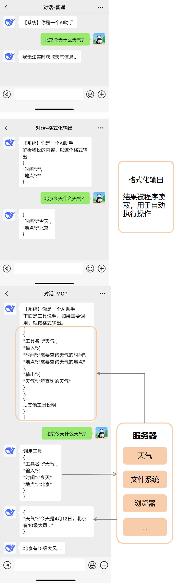

# MCP

# 想法

MCP的思想：把工具描述提供给模型判断是否调用，以及调用参数。
感觉用LLM理解人说的话，并自动执行命令是必要的。但目前使用流程不一定是最优方案。一些想法：

1. 工具多的情况。系统提示词很长，带来速度慢，结果差。
可以先筛选一遍工具，比如用embedding模型取相似度最高的1个或多个工具。
1. 复杂处理流程。上下文长，消耗Tokens多且速度慢。
是否可以生成调用代码，一次性得到所有结果。另外如果工具调用方式是代码了，那给模型的工具说明也可以是代码？
