# 引言
当前大模型发展迅速，一方面模型能力进步很快，另一方面使用成本降低也很快。模型价格每百万tokens又降到了几块钱是经常听到的新闻。
那么怎么定量的计算模型推理成本呢？本文寻找和算力相关的指标，并尝试将这些指标连接到一起。

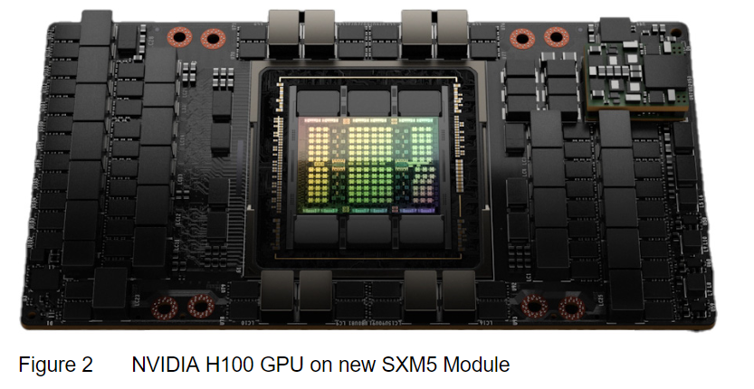

H100计算卡（图片来源：英伟达）

如图，这是一张H100计算卡。我们看看它的组成部分：

+ H100计算卡
  + 芯片
    + 逻辑芯片（图中彩色部分，1个。是从刻有多个芯片的晶圆上裁下来的。）
    + 显存芯片（逻辑芯片周围，6个）
  + 供电和各种数据接口

本文的指标从晶圆的成本，也就是从芯片制程开始讨论。

# 制程

## 制程的指标

什么指标能代表芯片制程？
是“3nm”，“5nm”代表的芯片制程吗？现在这个名字只是代号，不是实际的晶体管的大小。晶体管密度能更准确的代表工艺水平。密度提升同步带来功耗下降。功耗这个参数还有一个有点，能直接计算消耗的电力。
先进的制程晶体管密度高，功耗小，但是价格也越贵，因此价格也是一个指标。

## 从制程指标变化看摩尔定律

摩尔定律是“每隔2年，芯片上的晶体管数量翻倍”。

芯片晶体管数量随时间变化（图片来源wiki）

从这张图上看摩尔定律还在正常推进。不过只从“芯片上的晶体管数量”看摩尔定律有两个问题，一是图上的“晶体管数量增加”包含了“芯片面积增加”和“晶体管密度增加”两个因素，没有单独展示晶体管密度，第二个是没有包含价格因素。在摩尔定律是否要终结这件事上，就是这两个问题被讨论最多：

第一个是晶体管密度提升越来越困难。
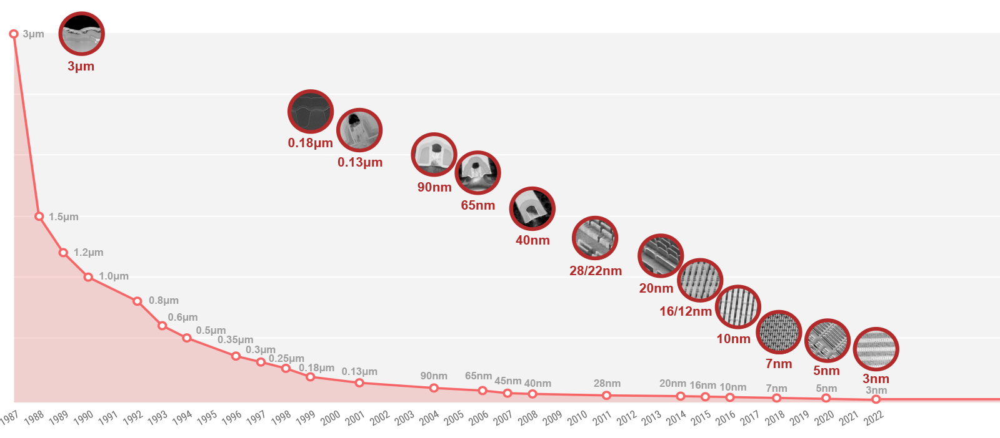

台积电芯片制程进展（图片来源 台积电官网）

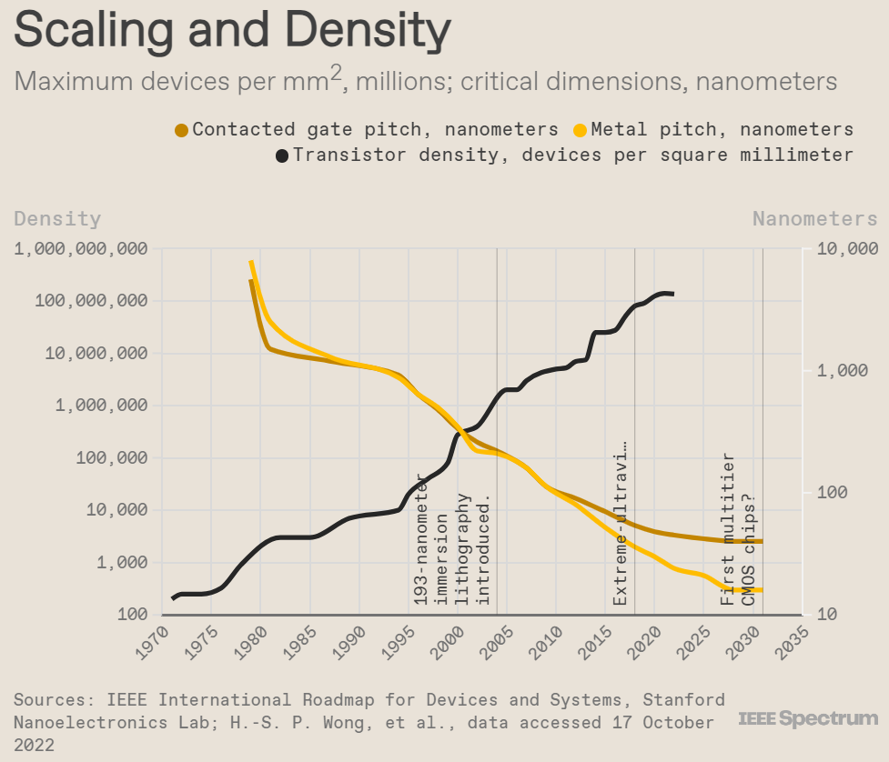

晶体管密度随时间变化（图片来源 IEEE spectrum）

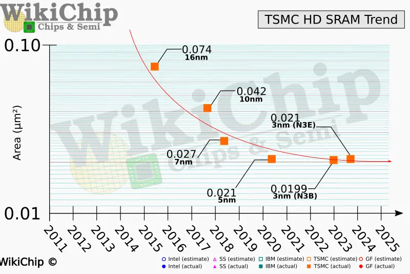

SRAM面积变化（图片来源WikiChip）

如图，芯片制程“xnm”还在推进，但是晶体管大小随时间指数变小已经失效，现在“3nm”工艺的晶体管实际间距约30nm。另外，由晶体管组成的SRAM和Logic单元中，SRAM的密度在近几年也没有提升。整体看晶体管密度，它还在继续推进，但是速度变慢。

第二个是芯片价格越来越高。
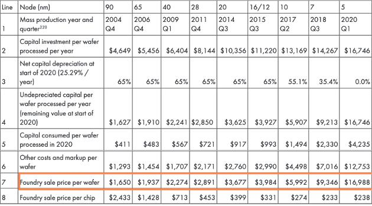

晶圆价格随制程变化（图片来源 electronicsweekly）

从单片晶圆的价格看，先进制程的价格指数升高。

单位晶体管价格也不再下降，如图。

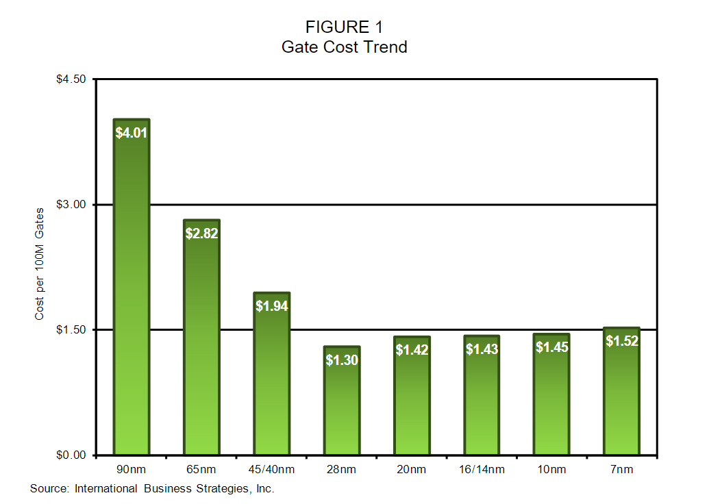

单位晶体管价格趋势（图片来源 IBS）

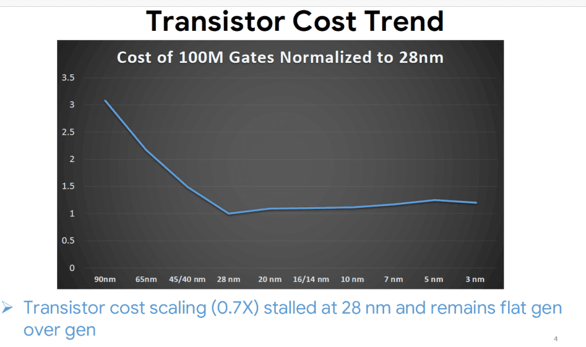

单位晶体管价格趋势（图片来源 semiconductor-digest）

没有找到把功耗和价格画在一张图上的，用上面的晶圆价格和对应的GPU信息自己画了一个：
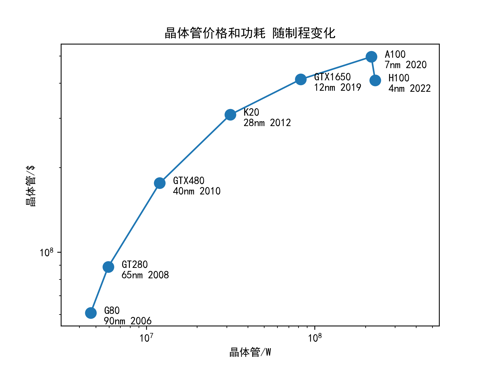

晶体管价格和功耗 变化趋势

注：
1. 画图时，希望让右方和上方代表制程进步的方向，所以把“单位晶体管价格”和“单位晶体管功耗”取倒数，变成“单位价格晶体管数量”和“单位功耗能支持的晶体管数量”。
2. 价格计算方式：单位面积晶体管数量/单位面积晶圆价格。功耗计算方式：晶体管数量/GPU的TDP。（更精确应该只使用logic芯片的功耗，没有搜到，不过不影响在对数坐标图上看趋势）。

总结制程的发展：
1. 晶体管功耗进展变慢，但还在继续。
2. 晶体管价格进展逐渐停止，甚至开始倒退。

## 补充：为什么是“价格”和“功耗”

制程上的指标很多，为什么不是“芯片上的晶体管数量”，也不是“晶体管大小”，而是这两个？

答：相比于“晶体管大小”，“SRAM面积”这样的技术指标，“价格”和“功耗”是用户感受层面的指标。用玩游戏举例，4070玩《黑神话：悟空》有60帧，那新出一个显卡5070，它用了一个更好的架构，增加了很多CudaCore，这是内在指标，打游戏有90帧，这是玩家感受到的指标。然后是价格，在性能是1.5倍情况下，价格不变就是大提升，价格也是1.5倍就是没提升。

摩尔定律广义上可以是“计算成本的逐年下降”。制程的进展依赖于：投资先进制程-获取超额回报-继续投资更先进制程这个循环。计算成本下降是目的，晶体管变小是实现方法。从计算成本考虑，“价格”和“功耗”代表晶体管的一次购买和使用成本。
一个比喻：如果把晶体管看做运输信息的小车，那“单位晶体管价格”是车的售价，“单位晶体管功耗”是百公里油耗/电耗。

# 芯片

本节先讨论逻辑芯片的指标，然后是计算卡。

## 逻辑芯片

### 芯片设计指标

评价芯片能力最常用的指标是PPA

+ performance，性能
+ power，功耗
+ area，面积

为了下面这两个目的，把性能指标分解。

1. 独立芯片设计，把芯片性能的制程部分和芯片设计分开
2. 对比不同芯片架构的区别

芯片算力 = 芯片面积 * 单位面积晶体管数量 * 单位晶体管算力

这样把属于制程的“单位面积晶体管数量”指标排除，可以来用“单位晶体管算力”定量对比不同架构。

### 单位晶体管算力-不同架构对比

| 芯片架构       | 芯片         | 晶体管数量                             | 算力                                                    | 单位晶体管算力 |
| -------------- | ------------ | -------------------------------------- | ------------------------------------------------------- | -------------- |
| CPU            | Intel 13900  | 25.7B （用257mm2 x 100M/mm2估算） | 134.4G@FP32 （24核 x 5.6GHz x 每周期一次FP32计算） | 5@FP32         |
| CPU 向量单元   | Intel 13900  | 25.7B                                  | 2T@FP32 （每周期512/32=16次FP32计算）              | 80@FP32        |
| GPU CudaCore   | NVIDIA H100  | 80B                                    | 60T@FP32                                                | 750@FP32       |
| GPU TensorCore | NVIDIA H100 | 80B                                    | 417T@TF32                                               | 5200@TF32      |
| Google TPU     | TPU v4       | 22B                                    | 275T@BF16                                               | 12500@BF16     |

注：
1. 由于同一芯片可能有多重算力类型（如H100有CudaCore，TensorCore，TensorCore也有FP16，FP8等多种数据类型算力），实际的“单位晶体管算力”会更大，这里简单对比不同架构，只统计其中一种算力类型。
2. 单位晶体管算力，除了架构影响外，还有晶体管本身性能影响。在比较接近的制程时，假设晶体管性能接近。

可以看出芯片架构从CPU到GPU，再到矩阵乘定制架构（GPU的TensorCore和TPU），单位晶体管算力有数量级的提升。

### 不同架构的比喻

从算力上对比了不同架构的区别，再来一个比喻，给不了解计算机的同学解释CPU，GPU架构的区别。因为不喜欢“CPU是老教授，GPU是一群小学生”这个比喻，想了一个新的：
CPU和GPU都两个小学生，目标是写作业。作业都很简单就是抄一些字或者加减乘除，主要是看谁写字写的快，他们在“写得快”上卷的方式不一样。
CPU是把手锻炼的特别灵活，写字快。而且手眼配合好，在写这个字的时候，眼睛已经转过去在看下一个字要怎么写，这样写字不用停。CPU在一个字一个字地写这条路上卷到了极致。
GPU想，为了卷赢CPU我得换个思路。然后就一只手拿起了2支笔--别笑，我猜你小时候也这么干过。实际上不只2支，GPU是一个手指怪物，一个手能拿32支笔一起写字。同时，GPU还是“千手观音”，长了非常多的手同时在写。比如4090说自己有16384个cuda core的时候，指的是它有512个手，每个手拿32支笔。一共16384支笔同时写作业，把CPU卷麻了。
~~无端联想：所以GPU内部是指头遗迹？~~
那么TensorCore呢？GPU发现在AI这门课的作业里，有大量连着多行多列都重复的字要写，于是就刻了一个大印章，印着16，每行16个字。TensorCore就是这个章，写这科作业的时候就疯狂盖章，啪一下就完成256个字。

说明：

1. GPU相对CPU的优势，是使用相同的晶体管（细胞）和能量，GPU算力更大（单位时间写字更多）。TensorCore优势同理。
2. CUDA是什么？在GPU这样很多手的情况下，怎么控制这些手就很重要，CUDA是连接要写的作业和手的神经系统。
3. TensorCore这种盖章的方式，是得有这样的作业才能这么用。只适合计算大矩阵乘法（神经网络里有很多）。

### 算力10年提升1000倍-分解
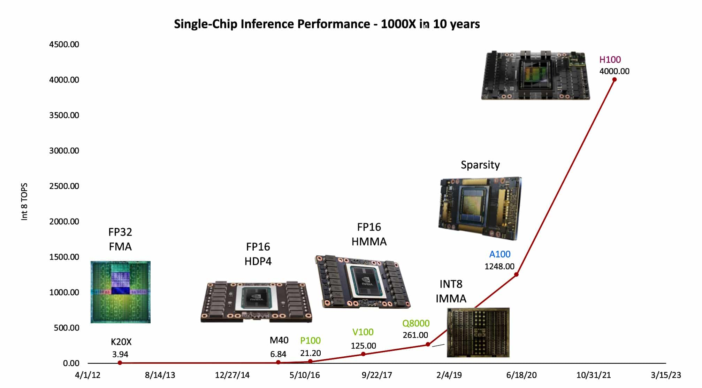

算力10年提升1000倍（图片来源：英伟达）

用本节的指标分解，看H100对比K20X的1000倍提升是怎么来的：
+ 晶体管数量提升：约10倍。 从7.08B提高到80B，对应H100的算力67T@FP32
+ 矩阵乘定制架构提升：约10倍。500T@TF32
+ 低精度数据：4倍。2000T@FP8
+ 稀疏计算：2倍。4000T@FP8
注：4000T@FP8算力指标是H100的SXM版本，文章其他部分使用的是H100的NVL版本指标，数值有少量差异。

## 计算卡

计算卡成本可以简单分为三部分：
+ 硬件设计和制造第一张卡的成本
+ 硬件成本，即后续每张卡的成本
+ 软件

硬件设计领域不熟悉所以不讨论。软件部分，从计算卡到能用的算力之间隔着编译器（NVCC），加速库（cnDNN）和易用的训练/推理工具（pytorch-cuda和TensorRT）。虽然我的工作就是算力的软件部分，但这一整套系统太复杂，先挖个坑以后再填。
因此本节只分析硬件成本和用户使用成本。

### 硬件成本和售价
硬件成本和售价分析，在“谈一下英伟达帝国的破腚”这篇文章里写的太有趣了，推荐去看原文（链接在附录），这里摘抄成本分解和其中一段分析：
+ 逻辑芯片 约300$ （按15000\$ 的晶圆切50片芯片估计）
+ HBM 约1200$ （80GB x 15\$/GB）
+ 逻辑芯片和HBM封装 约300$
+ SXM 约300$

H100硬件成本约2000$，售价$30000。

“TSMC曾经讲过一个故事。台湾同胞辛辛苦苦攒钱建厂，一张4nm那么先进的工艺哦，才能卖到$15000，但是那某个客户拿去噢，能卖出$1500000（$30000*50）的货啦，机车，那样很讨厌耶。你懂我意思吗？”

### 使用成本
将计算卡。以DGX H100为例，有8张H100的机器售价约500K$，功耗10kW。
算力成本为：

| 指标         | 单位：H100                             | 单位：TF32算力 | 单位：FP16算力 |
| ------------ | -------------------------------------- | -------------- | -------------- |
| 算力设备成本 | 约1.4\$/h (按使用5年平摊到每小时) | 3.4\$/(P*h)    | 1.7\$/(P*h)    |
| 能源消耗     | 约0.13\$/h (按每度电0.1$)  | 0.3\$/(P*h)    | 0.15\$/(P*h)   |
| 合计成本     | 约1.5\$/h                              | 3.7\$/(P*h)    | 1.8\$/(P*h)    |

### 算力云服务

如果直接租算力，云服务厂商租H100价格范围约2.5-5$/h。

比如aws上8卡H100设备约39$/h。
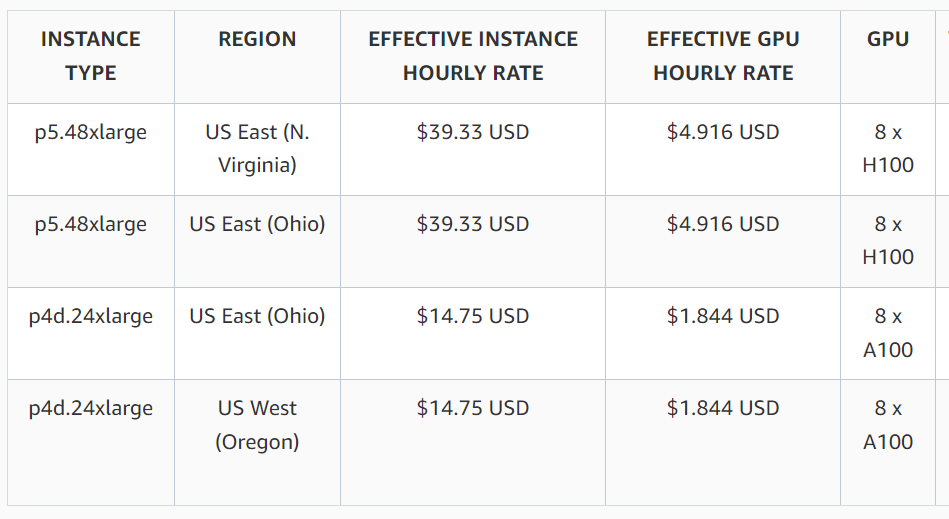

H100价格（数据来源 aws）

# 模型

## 训练推理成本

模型训练和推理所需算力已经有很好的分析文章（附录有链接），直接给出简化结论：
$$训练计算量 = 模型参数量 * tokens数量 * 6$$
$$推理计算量 = 模型参数量 * tokens数量 * 2$$
$$计算成本 = 单卡每小时成本 * 卡时 = 单卡每小时成本 * \frac{计算量}{单卡算力/s * 3600s/h * 利用率}$$

可用根据此公式，估计模型计算成本。
以GPT3为例，参数量175B，训练tokens300B。H100单卡算力835T@FP16，用算力利用率50%，单卡每小时1.5$估算
$$训练成本 = 1.5 * \frac{175B * 300B * 6}{835T * 3600 * 0.5} = 约300,000\$$$
$$推理成本 = 1.5 * \frac{175B * 1M * 2}{835T * 3600 * 0.5} = 约0.3\$/(M tokens)$$

## 模型云服务
计算设备有云服务，模型推理也有。这是硅基流动提供的部分模型和价格：

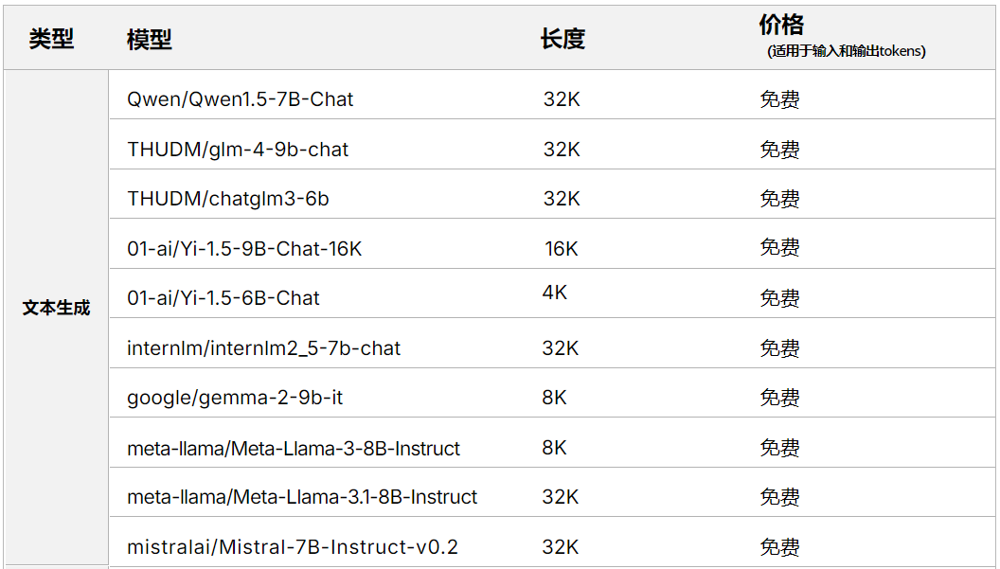
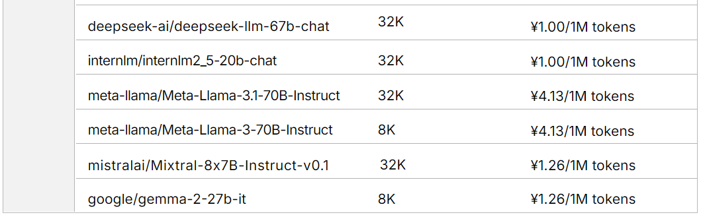

模型价格（数据来源 硅基流动）

在模型计算成本中，提升算力利用率可以降低成本，降低模型价格。最近一年模型推理价格下降很快，从图中可以看到有很多模型是免费的，有利于更多的人基于语言模型做产品。

### 模型云服务的指标
参与了硅基流动的产品体验活动，从用户角度补充一些指标和测试结果。

（1）模型的丰富程度
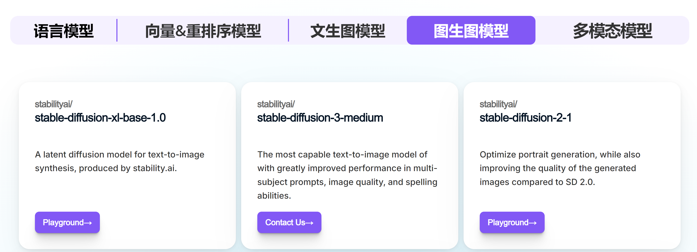

模型类型（图片来源：硅基流动）

1. 模型类型。比如图中有语言模型，图像语音和视频模型，还有向量重排序模型。
2. 单类模型丰富程度。比如语言模型，支持从1.5B的通义千问到405B的Llama3.1等不同大小的开源模型。

（2）速度

对于实时的应用来说，模型的响应速度很重要。测试了几个模型：

|模型|第一个token时间（ms）|后续tokens速度（每秒）|
|---|---|---|
|Qwen2-1.5B|138|98|
|Qwen2-7B|187|85|
|Yi-1.5-34B|234|59|
|deepseek-llm-67b|277|32|
|Llama-3.1-405B|272|51|

第一个token时间约100-300ms。模型大小从1.5B到405B，tokens速度都是几十，从使用角度，这是一个比大部分人阅读更快的速度。

额外测试了字节跳动的火山引擎，如下表。

|模型|第一个token时间（ms）|后续tokens速度（每秒）|
|---|---|---|
|Mistral-7B|156|53|
|Doubao-lite-4k|188|37|
|Doubao-pro-32k|199|21|

（3）稳定性

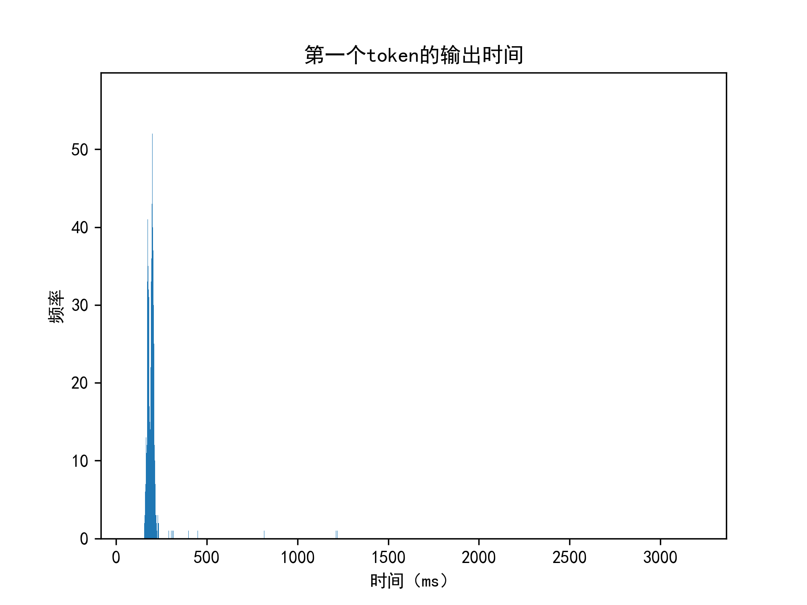

第一个token的输出时间

上图是稳定性测试结果，测试一天中（每分钟一次，共1440次）第一个token输出时间。绝大部分时间在200ms附近，超过500ms的比例为0.3%，最长时间为3.2s。

注：
1. 以上数据只代表当前时间点，我所在位置的测试结果。
2. 测试代码为(data/cloud_service/test.py)。

# 总结

本文围绕算力成本，从晶圆价格出发连接到逻辑芯片成本，然后是计算卡成本，最后是模型计算成本。以降低模型成本为目标，总结各个层级的影响：
1. 芯片制程
   1. 制程提升：单位算力功耗下降。
   2. 先进制程价格随时间下降：单位算力价格下降。
2. 芯片设计
   1. 芯片架构提升：单位晶体管算力提升。
   2. 计算软件：算力利用率提升。
3. 模型算法
   1. 相同能力的模型，参数量下降。
   2. 相同模型，低精度计算效果接近。

将所有因素综合起来看，未来10年模型使用成本下降1000倍是非常有可能的。

# 附 参考资料

## 推荐阅读的文章

英伟达的破绽系列
[谈一下英伟达帝国的破腚](https://zhuanlan.zhihu.com/p/639181571)
[英伟达的破绽](https://zhuanlan.zhihu.com/p/640901476)
[英伟达的更多破绽](https://zhuanlan.zhihu.com/p/690255983)

LLM所需算力
[GPGPU视角下的大算力与大模型的供需关系](https://zhuanlan.zhihu.com/p/613071086)
[the-economics-of-large-language-models](https://sunyan.substack.com/p/the-economics-of-large-language-models)
[分析transformer模型的参数量、计算量、中间激活、KV cache](https://zhuanlan.zhihu.com/p/624740065)

## 数据引用
[1]: https://www.nvidia.com/en-us/data-center/h100/   "NVIDIA H100 参数"
[2]: https://www.istockphoto.com/en/photo/silicon-wafer-with-processor-cores-gm121235753-16963250 "晶圆图片"
[3]: https://www.zhihu.com/question/22275392 "晶圆生产成本"
[4]: https://www.linkedin.com/pulse/talk-chip-design-tape-out-verification-manufacturing/ "晶圆生产成本"
[5]: https://en.wikipedia.org/wiki/Moore%27s_law "摩尔定律"
[6]: https://spectrum.ieee.org/transistor-density "晶体管密度随时间变化"
[7]: https://www.tsmc.com/sites/dcom/2023-03/Process-Technology-Nodes_20230220.png "台积电芯片制程进展图"
[8]: https://fuse.wikichip.org/news/7343/iedm-2022-did-we-just-witness-the-death-of-sram/ "SRAM密度随时间变化"
[9]: https://www.electronicsweekly.com/blogs/mannerisms/manuf/rising-wafer-cost-2020-10/ "晶圆价格随制程变化"
[10]: https://en.wikipedia.org/wiki/3_nm_process "芯片制程细节"
[11]: https://www.intel.cn/content/www/cn/zh/products/sku/230499/intel-core-i913900-processor-36m-cache-up-to-5-60-ghz/specifications.html "intel 13900 参数"
[12]: https://www.techpowerup.com/cpu-specs/core-i9-13900.c2854 "intel 13900 参数"
[13]: https://www.techpowerup.com/gpu-specs/tesla-k20x.c2315 "K20x 参数"
[14]: https://blogs.nvidia.com/blog/huangs-law-dally-hot-chips/ "算力提升10年1000倍 图片"
[15]: https://www.ibs-inc.net/white-papers "单位晶体管价格变化趋势 IBS 2016年"
[16]: https://www.semiconductor-digest.com/moores-law-indeed-stopped-at-28nm/ "单位晶体管价格趋势 semiconductor-digest"
[17]: https://www.viperatech.com/product/nvidia-dgx-h100-p4387-system-640gb/ "DGX H100 价格"
[18]: https://lambdalabs.com/ "H100 租用价格 $2.49"
[19]: https://aws.amazon.com/cn/ec2/capacityblocks/pricing/ "H100 aws 租用价格 5$"
[20]: https://siliconflow.cn/zh-cn/pricing "模型云服务价格 硅基流动"
[21]: https://siliconflow.cn/zh-cn/activity "SiliconCloud产品体验官招募中 硅基流动"
[22]: https://www.volcengine.com/ "火山引擎"
