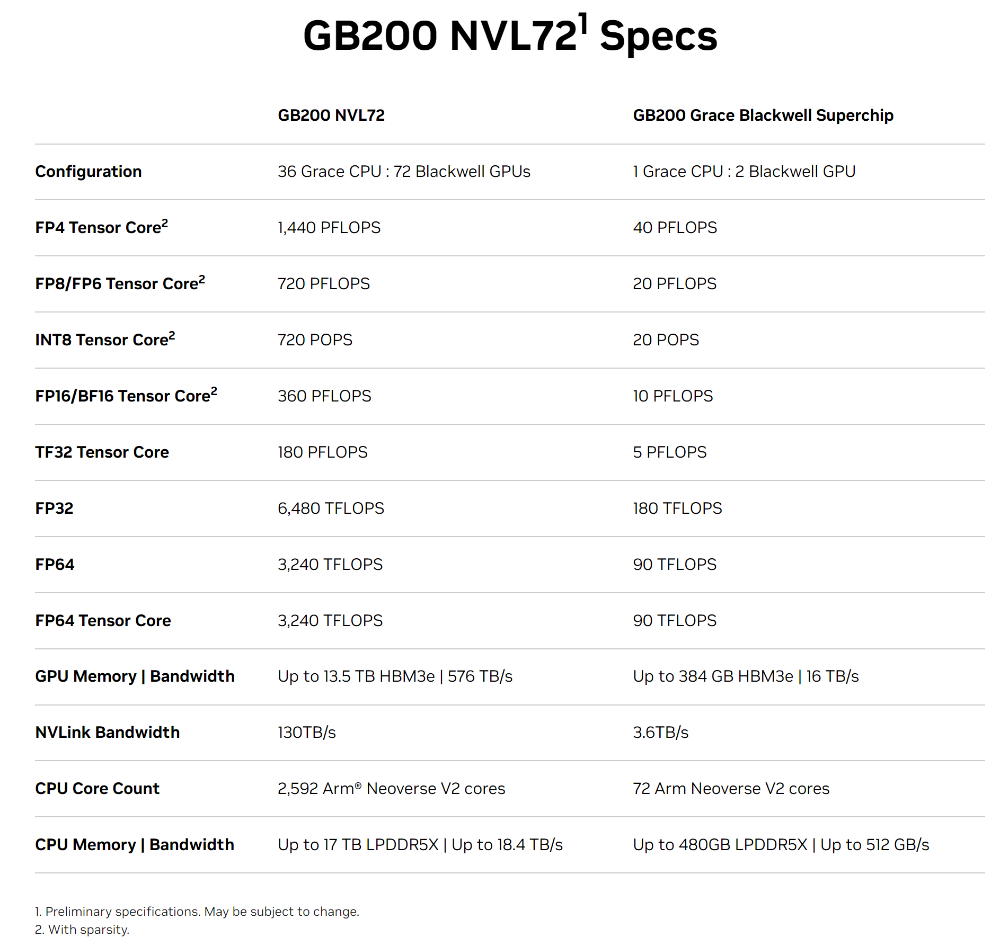
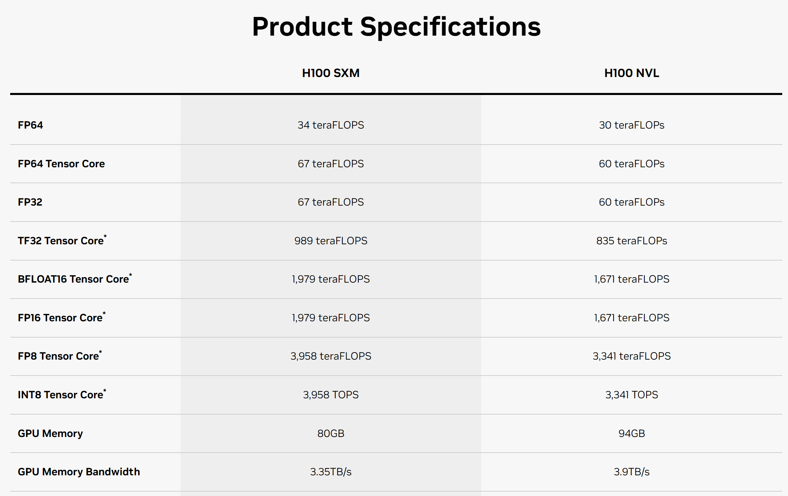
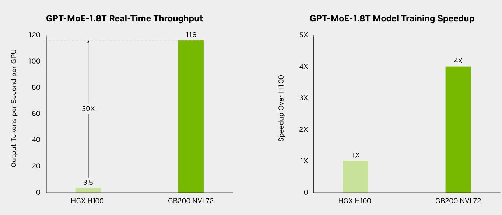
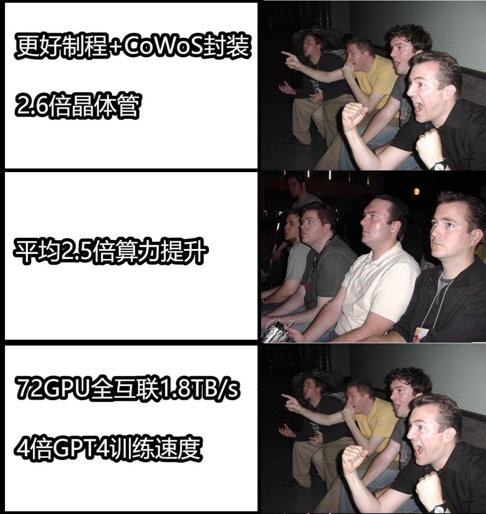
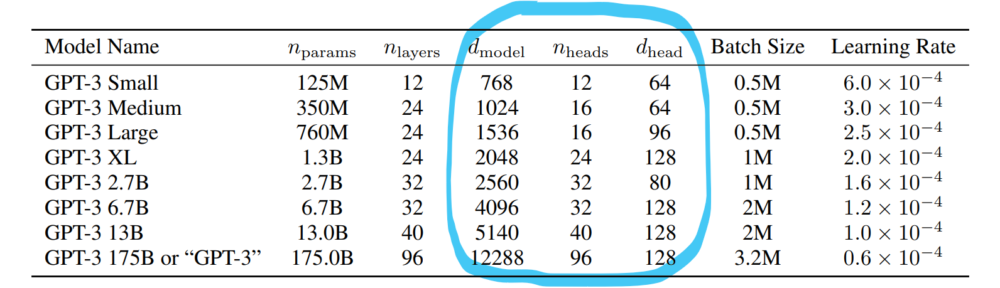
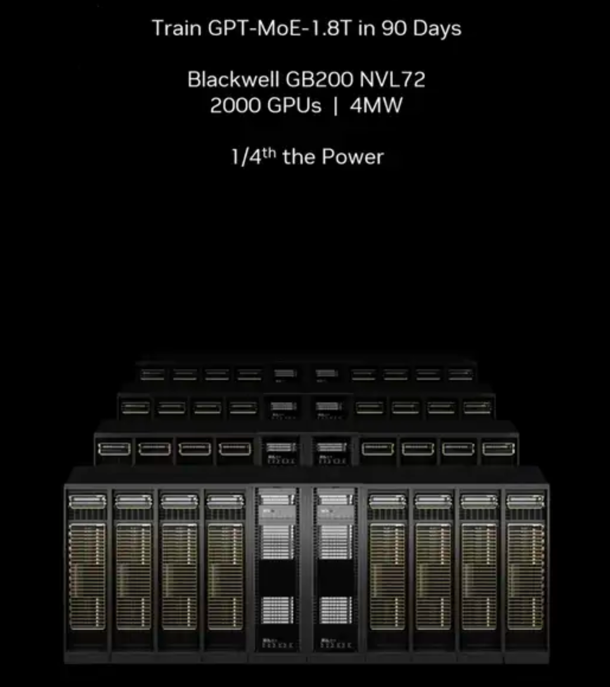
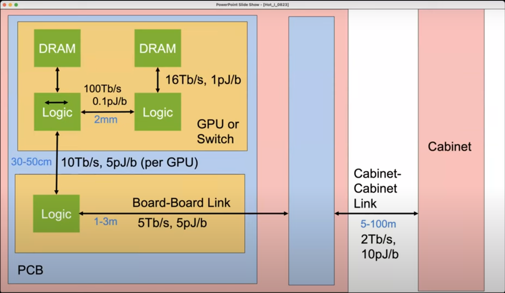

# 引言

在芯片升级过程中哪些参数会变化，哪些不变，这些参数和算法有什么对应关系？本文以B200为例分析这些问题。先对比和上一代H100的变化，然后讨论芯片与算法的参数是怎么匹配的。

# B200 对比 H100

官网数据如图：

结合制程信息，对比如下表：

|                                | H100                          | B200                             | 对比                                                                                                      |
| -------------------------------- | ------------------------------- | ---------------------------------- | ----------------------------------------------------------------------------------------------------------- |
| 制程 面积 晶体管数量 | N4 814mm2 80B       | 4NP 1600mm2 208B       | 晶体管密度提升：约1.3倍。100M -> 130M/mm2 面积增加：约2倍。(2个die封装到一起) 晶体管数量：2.6倍 |
| 算力                           | 495T@TF32 ... 0@FP4 | 1250T@TF32 ... 10P@FP4 | 算力提升：约2.5倍 增加FP4算力                                                                        |
| 显存                           | 80GB                          | 192GB                            | 2.4倍                                                                                                     |
| 显存带宽                       | 3.35TB/s                      | 8TB/s                            | 2.4倍                                                                                                     |
| 互联带宽                       | 900GB/s                       | 1.8TB/s                          | 2倍                                                                                                       |

注：本文算力值都使用非稀疏算力。H100使用算力更高的SXM数据。

## 算力提升倍数

算力比较，按TF32同类型对比是2.5倍。如果按最大算力，即B200的FP4比H100的FP8，则是5倍。详细表如下：

| 类型                  | H100 算力 | B200 算力 | H100 每晶体管算力 | B200 每晶体管算力 |
| ----------------------- | ----------- | ----------- | ------------------- | ------------------- |
| FP64                  | 34T       | 45T       | 425               | 216               |
| FP64 Tensor Core      | 67T       | 45T       | 837               | 216               |
| FP32                  | 67T       | 90T       | 837               | 432               |
| TF32 Tensor Core      | 495T      | 1250T     | 6187              | 6009              |
| FP16/BF16 Tensor Core | 989T      | 2500T     | 12362             | 12019             |
| FP8/INT8 Tensor Core  | 1979T     | 5000T     | 24737             | 24038             |
| FP4 Tensor Core       |           | 10,000T   |                   | 48077             |

从每晶体管算力看，B200的FP64和FP32是下降的，其他项几乎不变，新增了FP4算力。这么看新增的FP4的算力是从这里面挤出来的，平均下来每晶体管算力变化很小。

【疑问】难道从GPU的设计上，已经很难再提升了？还是说这一代有FP4算力，按最大算力提升已经很好看了（5倍），下一代再整体提升。

## 没有直接标注的重要参数：计算传输比

算力是单位时间计算次数，除以单位时间可以传输的数据个数，可以得到计算传输比。用它可以判断算法是“计算瓶颈”还是“带宽瓶颈”，以及是否还有优化空间。下一章会讨论这个值和算法的关系，所以这儿先看一下它的特点。

数值对比见下表（忽略FP64）：

| 数据类型                                                                                   | H100 计算传输比 | B200 计算传输比 | B200 计算方式                                                                                                                                                                                            |
| -------------------------------------------------------------------------------------------- | ---------------------- | ---------------------- | --------------------------------------------------------------------------------------------------------------------------------------------------------------------------------------------------------------- |
| FP32                                                                                       | 80                   | 45                   | 90T/(8T/每数据4字节)                                                                                                                                                                                          |
| Tensor Core TF32 Tensor Core FP16/BF16 Tensor Core FP8/INT8 Tensor Core FP4 | 591                  | 625                  | 1250T/(8T/每数据4字节) 2500T/(8T/每数据2字节) 其他类似 注：TF32虽然是19bit，按照在显存中32bit存储计算。 有的文章会用 FLOPS/Bytes 这个单位表示，目的是一样的。本文采用不包含数据类型的量纲。 |

从表中看有这几个特点：

1. TensorCore（矩阵乘计算）的值是625，比CudaCore（通用计算）的值45大一个数量级。
2. TensorCore的不同数据精度，值相同。
3. B200相比H100，FP32的值变小，TensorCore的值几乎不变。

## 互联方案：NVL72

比较多个GPU之间互联的方案。

DGX H100产品互联方式是：DGX内部任意两个GPU之间有900GB/s的NVLink互联，多个DGX之间互联速度则低数倍。

B200 NVL72互联方式：72个GPU之间1.8TB/s的NVLink互联。

互联的提升可以提高多卡并行的效率，可以获得比纯单卡算力提升更多的计算效率。从官网看训练和推理都有很大提升：

注：推理的30倍加速是某个特殊情况的效果，具体可参考附录中NVIDIA的文章。

## 总结

综合来看B200提升主要来自芯片更大，互联更快。

# 芯片算法适配-配比

上一章的芯片变化，可以拆成两部分：芯片整体变大和内部构成变化。先看内部各部分配比。

## 算子的“计算瓶颈”和“带宽瓶颈”

考虑一个极简模型：“存储-传输-计算”。数据从存储单元传输到计算单元，结果再传输回存储单元。

比如有一个算子，其输入输出和计算过程确定，则计算传输比是定值。
这个值如果大于芯片的计算传输比，即需要的计算更多，那么它是“计算瓶颈”，如果小于则是“带宽瓶颈”，最好的情况是算子和芯片的计算传输比一致。
（注：这里假设计算过程已经优化，即计算和传输的过程相互掩盖，而不是顺序执行。）

不同的算子，计算传输比差异很大，用一大一小2个典型算子做对比：

| 算子   | 公式 （数据维度）         | 传输量   | 计算量 | 计算传输比      |
| -------- | -------------------------------- | ---------- | -------- | ----------------- |
| 向量加 | C = A + B  (N=N+N)        | 3N       | N      | 1/3             |
| 矩阵乘 | C = A x B  (MN = MK x KN) | MN+MK+KN | 2MKN   | 2MKN/(MN+MK+KN) |

向量加的值很小（1/3），很多其他简单计算也是。矩阵乘的值用“M，K，N”表示不容易看出具体大小，将这三个值按“大，中，小”带入化简：

(大中小x2)/(大中+大小+中小) = (小x2)/(1+小/中+小/大)

+ 极端情况1，大中小相同，值为：小*2/3。
+ 极端情况2，大中小差异很大，值为：小*2。
+ 简单结论：值主要取决于维度最小的值。

## 举例：Transformer

在Transformer计算过程中，大部分计算是矩阵乘，维度取决于计算tokens的长度s和特征维度d_model。比如计算QKV是“sd x dd”。
其中d_model的值取决于模型，如下图GPT3不同大小的模型维度约1k到10k：

s的值分2个阶段：

1. （输入tokens）Prefill：现在的模型通常支持8k或更高的32k，128k输入。
2. （输出tokens）Decode：一般存储kv-cache，只计算最新的一个token值，也就是s为1。

综上，简单的结论是：Transformer计算主要是矩阵乘，矩阵乘的计算传输比主要取决于维度最小的值，就是s和d中更小的值。这个值从个位数到10k都有可能。

回看上一章，对比芯片的计算传输比：

1. CudaCore（通用计算）是45，TensorCore（矩阵乘）是625。对应矩阵乘的计算传输比大，其他计算低。
2. TensorCore多个数据类型值不变。比如相同带宽传输FP8，传输数据量是FP16的2倍，因此芯片FP8算力是FP16的2倍。这保证了改变计算精度时，可以使用同一套优化策略，计算利用率不变。
3. 从Transformer计算过程可得prefill阶段通常是计算瓶颈，Decode是带宽瓶颈。

为了利用芯片的算力，理想状态是计算过程和芯片的计算传输比一致。不过由于：

1. 算子之间的差异
2. 不同模型，不同计算阶段的差异
3. 不同芯片之间的差异

简单的一个个算子计算，利用率极低。所以有了多种优化方法：

| 现象                                 | 优化方式                      | 优化示例                                                                                                                               |
| -------------------------------------- | ------------------------------- | ---------------------------------------------------------------------------------------------------------------------------------------- |
| tokens少时，矩阵乘最小维度小         | 用更大的batch，增加计算传输比 |                                                                                                                                        |
| 单算子计算传输比小                   | 算子融合                      | [flash-attention](https://github.com/Dao-AILab/flash-attention)  [FasterTransformer](https://github.com/NVIDIA/FasterTransformer) |
| Prefill和Decode差异大                | 在不同的设备计算              | [DistServe](https://github.com/LLMServe/DistServe)                                                                                     |
| 权重存在稀疏现象，且芯片稀疏化算力高 | 网络稀疏化                    | [MaskLLM](https://github.com/NVlabs/MaskLLM)                                                                                           |

注：效率优化方法有很多，另外关于kv-cache存储的优化也重要但本文没涉及，可以查看附录中的文章。

## 并行和互联带宽

用单张卡的算力，与互联的带宽相除，就是并行计算的“计算传输比”。像上面讨论的算子的利用率一样，它影响并行计算的利用率。

几种并行方式（细节可以看附录中的文章）的特点是：

| 并行方式     | 计算拆分   | 传输数据量       | 权重复制 | （推理过程）降低tokens延迟 |
| -------------- | ------------ | ------------------ | ---------- | ---------------------------- |
| 张量并行     | 单算子     | 大               | 否       | 是                         |
| pipeline并行 | 不同的层   | 较小             | 否       | 否                         |
| 数据并行     | 不同的数据 | （训练过程）较大 | 是       | 否                         |

结合B200互联的变化（只看最高速的NVLink，再外层还有速度小一个数量级的互联）：

|            | H100                | B200                    | 变化   |
| ------------ | --------------------- | ------------------------- | -------- |
| 计算传输比 | 2.2k                | 2.8k                    | 变化小 |
| 互联数量   | 8 （DGX H100） | 72 （GB200 NVL72） | 9倍    |

互联阶段的计算传输比变化不大，和GPU内部比大约是4倍，相当于互联数据传输小于内部传输1/4时，不会降低计算利用率。NVL72把互联数量提升到了72，它可以提高张量并行的数量。张量并行的特点是：

1. 劣势：传输数据量大。需要高速的互联。（注：硬件确定的情况下，另一种提升并行数量的方法是减小数据传输。比如[Megatron-LM](https://arxiv.org/abs/1909.08053)）
2. 优势：不需要复制权重或排pipeline。
3. 优势：降低推理延迟。（注：在推理405B的Llama模型时，8卡H100并行输出tokens约10-30/s。如果有更大的模型，却不提高并行能力，那么实时推理会很难用。）

从这些特点看，张量并行更像GPU内部SM之间的并行。在有高速互联的情况下，多个GPU扩展后接近单个GPU计算的效果。

# 芯片算法适配-更大

看完配比，再看看芯片变大能产生什么变化。

## 芯片变大也是芯片变小

与其说芯片变大，不如说它变小了。B200相比H100有2.6倍的晶体管，2.4倍的显存，以及更大的互联。那么什么变小了呢，看发布会上这个数据：

在“训练GPT4的芯片”这个维度上，芯片变小了。使用的GPU数量和能耗都变成了1/4。

## 算法和芯片变化趋势

过去几十年，芯片一直在变小。主线是“晶体管距离”变小，能够增加晶体管数量，减少能耗。现在，LLM在计算上有新的特点，就是带宽需求大。这带来了传输带宽和能耗的问题，这也是新的“芯片变小”的趋势。看这张传输带宽和功耗图：

从逻辑单元内部，到逻辑单元和显存，再到其他GPU，其他机柜的GPU，带宽（Tb/s）会下降1数量级，而能耗（pJ/b）会涨1个数量级。

把目前让芯片变小的方法汇总：

|            | 技术方法                         | 目标                     |
| ------------ | ---------------------------------- | -------------------------- |
| 先进制程   | 减小晶体管距离                   | 增加晶体管密度，降低能耗 |
| 先进封装   | 减小逻辑单元，存储单元之间的距离 | 增加带宽，降低能耗       |
| 更好的互联 | 减小计算卡之间的距离             | 增加互联带宽，降低能耗   |

对应从H100到B200的变化：

|         | H100                 | B200                  | 说明                                            |
| --------- | ---------------------- | ----------------------- | ------------------------------------------------- |
| 制程    | N4                   | 4NP                   | 晶体管密度100->130M/mm2                         |
| die尺寸 | 814mm2               | 800mm2                | 由于掩膜板尺寸限制，800已经接近极限，无法更大。 |
| 封装    | 1个die 6个HBM   | 2个die 8个HBM    | 更密集的逻辑单元，存储单元。                    |
| 互联    | 8卡互联 900GB/s | 72卡互联 1.8TB/s | 更多的高速互联，提升多卡并行计算效率。          |

## 回到最根本的指标-算力成本

最后，回到算力成本这个指标。先看H100的算力成本：

|            | 硬件成本                                                 | 能耗成本                                    | 能耗重要性           |
| ------------ | ---------------------------------------------------------- | --------------------------------------------- | ---------------------- |
| 用户角度   | 0.7\$/h （按单卡30000\$/5y估算 加上配套设备会更多） | 0.2\$/h （按总能耗2kw，0.1\$/kwh估算） | 很重要但不是占比最高 |
| NVIDIA角度 | 0.05\$/h （按单卡2000\$/5y估算 加上配套设备会更多） | 0.2\$/h （按总能耗2kw，0.1\$/kwh估算） | 最主要因素           |

站在芯片厂商角度考虑，能耗是最主要的成本因素。按照发布会的数据，GB200 NVL72训练能耗可以降低至原来1/4。

这么对比封装和互联的进步，已经超越制程进步，成为最重要的降低计算成本的技术。因为制程进步一代，只能把逻辑芯片的能耗降低百分之几十，在这整体的4倍中，绝大部分来自于封装和互联的提升。用上面的能耗图来理解就是：面对巨大的带宽需求，把5m的连接变成50cm，5mm，比把原来距离30nm的晶体管缩小更有性价比。

# 总结

本文以B200芯片和Transformer算法为例，定性和半定量分析了芯片参数和算法的关系。主要结论是：

1. 芯片内部配比变化较小。
2. 芯片和算法在互相匹配的时候能获得更高的利用率。由于算法的多样性，芯片内部配比会取一个中间值来平衡算法的“计算瓶颈”和“带宽瓶颈”，而面对已经确定的芯片，算法又有各种优化方法来提高利用率。
3. 由于算法巨大的带宽需求，芯片变得更紧凑来提高带宽，降低功耗。
4. 从算力成本考虑，封装和互联的对成本降低的影响超过了制程。

# 附

## 推荐阅读的文章

大模型效率优化：

[大模型加速系列文章](https://zhuanlan.zhihu.com/p/654910335)

[LLM大模型推理部署优化技术综述](https://zhuanlan.zhihu.com/p/655557420)

当前痛点“带宽需求”及其解决方案的讨论：

[Bill Dally 演讲 HOTI 2023](https://www.youtube.com/watch?v=napEsaJ5hMU)

[tsmc 关于下一代工厂的采访](https://morethanmoore.substack.com/p/q-and-a-with-tsmc-on-next-gen-foundry)

[站在AI Scale-Up域的一个岔路口](https://zhuanlan.zhihu.com/p/707355769)

[LLM推理到底需要什么样的芯片](https://zhuanlan.zhihu.com/p/683359705)

## 数据引用

[NVIDIA B200 参数](https://www.nvidia.com/en-us/data-center/gb200-nvl72/)

[NVIDIA B200 晶体管数量](https://www.techpowerup.com/gpu-specs/b200-sxm-192-gb.c4210)

[NVIDIA B200 制程 芯片面积](https://spectrum.ieee.org/nvidia-blackwell)

[NVIDIA H100 参数](https://www.nvidia.com/en-us/data-center/h100/)

[NVIDIA H100 晶体管数量 芯片面积](https://www.techpowerup.com/gpu-specs/h100-pcie-80-gb.c3899)

[GB200 推理加速数据：GPT-MoE 1.8T 推理文章](https://developer.nvidia.com/blog/demystifying-ai-inference-deployments-for-trillion-parameter-large-language-models/)

[GPT3 论文](https://arxiv.org/abs/2005.14165)

[reticle limit 26x33](https://www.anandtech.com/show/18876/tsmc-preps-sixreticlesize-super-carrier-interposer-for-extreme-sips)

[DGX H100 推理Llama 405B 速度](https://www.nextplatform.com/2024/09/10/the-battle-begins-for-ai-inference-compute-in-the-datacenter/)

